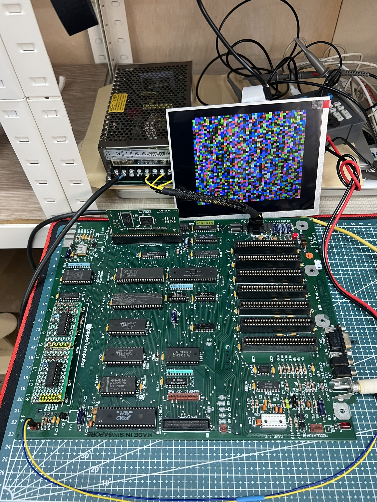

# a2e-4164-4464

Apple //e simple daughter board to replace 4x4164 with a single 4464

## Why I made this?

- My apple //e has faulty ram chips, and I want to replace them
- 4164 64x1 Kbits(1 data line), very hard to find in market
- 4464 64x4 Kbits(4 data lines), relatively easy to find in market
- 4x4164 can be replaced with 1x4464
- apple //e has 8x4164 chips on mainboard, so we can replace them with 2x4464 chips

## schematic

- 

## making

- 
- 
- 
- 

## references

- [4164 datasheet](4164.pdf)
- [4464 datasheet](4464.pdf)

---
That's all folks!
